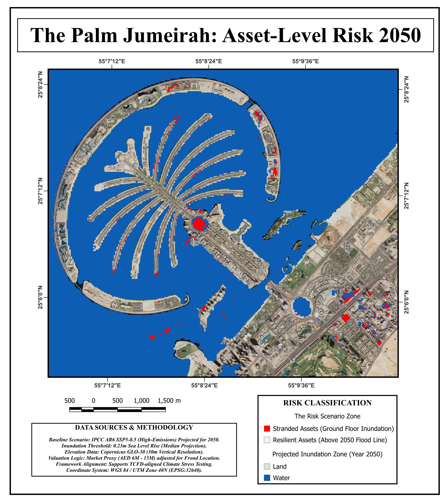

# The Palm Jumeirah: Stranded Asset Index 2050 🏝️📉
### Geospatial Risk Intelligence & Asset-Level Climate Stress-Test
**Analyst:** Mouparna Dhar (Climate Risk & Geospatial Analyst)  
**Document Ref:** UAE-SLR-2025-01  
**Portfolio Value:** AED 46.2 Billion

---

## 📊 Executive Overview
This repository contains a high-resolution geospatial audit and financial stress-test of the Palm Jumeirah real estate portfolio. By integrating IPCC AR6 High-Emission scenarios (SSP5-8.5) with sub-meter topographic data, this study identifies a structural **"Tipping Point"** post-2050 where cumulative Value-at-Risk (VaR) accelerates exponentially.

### Key Financial Statistics:
*   **Total Portfolio Audited:** AED 46.26 Billion
*   **Value-at-Risk (VaR) by 2050:** AED 2.25 Billion
*   **Critical Exposure Zone:** AED 4.11 Billion (Assets < 1.0m elevation)
*   **Individual Asset Evaluations:** 6,040 properties

---

## 🗺️ Geospatial Risk Analysis
The geospatial engine enables the identification of physical risk at the individual parcel level. By assigned a unique reference ID to every property, we link physical inundation probability directly to the bank's internal loan book.

*Fig 1: Asset-Level Risk Classification across the Palm Jumeirah (2050 Baseline).*

### Topographic Precision:
*   **Elevation Data:** ESA Copernicus GLO-30 Digital Elevation Model (DEM).
*   **Asset Footprints:** High-resolution extraction of 6,040 properties via OpenStreetMap (OSM) and Geofabrik.
*   **Coordinate System:** WGS 84 / UTM Zone 40N (EPSG:32640).

---

## 💹 Financial Exposure Segmentation
We have categorized the portfolio into four risk tiers based on ground-floor elevation relative to projected sea-level thresholds.

*   **Critical (< 1.0m):** AED 4.11B in value. Requires specialized 'Climate-Riders' and LTV adjustments.
*   **High (1.0m - 1.5m):** AED 1.92B. Vulnerable to extreme storm surge events.
*   **Low (> 2.0m):** AED 37.76B. Represents the resilient "Central Spine" (Trunk).

---

## 🌊 Temporal Inundation Progression
A side-by-side comparison reveals a critical topographic threshold. While the island maintains high structural resilience at the 0.23m baseline, the **1.50m Extreme Surge** scenario represents a systemic breach of the island’s engineered buffer.

### Risk Acceleration Timeline:

*Risk Analysis: Standard 30-year mortgages issued today will mature around 2055—the exact period where the risk curve steepens sharply as sea levels cross the 0.23m threshold.*

---

## 📍 Vulnerability Hotspot: Frond F
Micro-scale topographic stress tests identify localized "Inundation Danger Zones." On the outer edge of Frond F, 15 luxury properties have been identified with a total financial exposure of **AED 180M**.

*Recommendation: Immediate structural audit for assets in the red zone and lot-level sea gate installation.*

---

## 📈 Topographic Risk Profile
The Trunk remains the safest "Lending Zone" for financial institutions, maintaining a >10m safety buffer. Conversely, peripheral assets on the fronds show a **60% reduction in ground-floor elevation**, placing billions in value below the critical surge threshold.

---

## 🛠 Strategic Recommendations
1.  **Financial Policy:** Implement Climate-Adjusted Loan-to-Value (LTV) ratios. Outer-frond assets should be capped at lower LTVs (e.g., 60%) to protect bank capital.
2.  **Engineering:** Deploy automated, sensor-activated flood barriers at asset entry points below the 1.5m threshold.
3.  **Regulatory Compliance:** This geospatial methodology directly supports **CBUAE (Central Bank of the UAE) 2023 Guidelines** on Climate-Related Financial Risk Management.

---

## 📂 Repository Contents
*   `Palm_Jumeirah_Stranded_Asset_Index_2050.pdf`: Full Geospatial Risk Intelligence Report.
*   `index.html`: Interactive web dashboard for the audit.
*   `scripts/`: (If applicable) SQL and Python scripts for spatial joins and VaR aggregation.

---
**Contact:** Mouparna Dhar | Climate Risk & Geospatial Analyst  
*Integrating Geospatial Intelligence into the Credit Lifecycle.*
